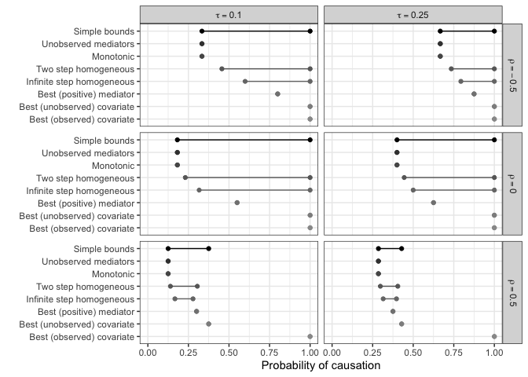
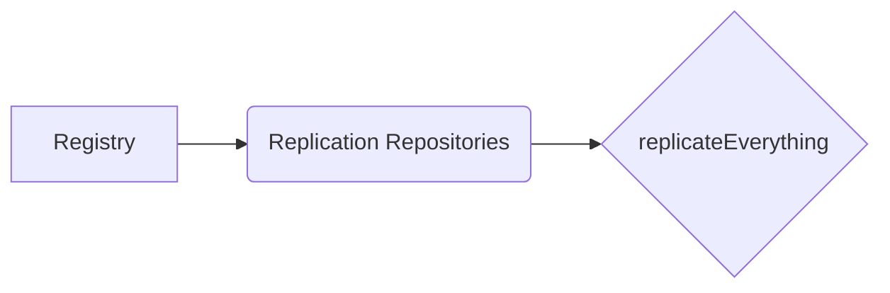

# replicateEverything


# replicateEverything

A platform for **reproducing academic research results programmatically
and simply**.

The package allows users to reproduce figures and tables from academic
papers using a standardized way by structuring the replication
repository in special way and adding it to a registry.

The goal is to make research **transparent, modular, and easily
reproducible**.

## Overview

`replicateEverything` provides a simple interface to:

- search replication-ready papers
- retrieve replication repositories
- reproduce figures and tables
- run full paper replications

The system is built around a **registry architecture** where replication
repositories are indexed and accessed dynamically, making it easier for
academics papers to be **replicated in one line of code.**

## Installation

Install the development version from GitHub by using `remotes` and
`devtools`.

``` r
if (!requireNamespace("replicateEverything", quietly = TRUE)) {
  options(repos = c(CRAN = "https://cloud.r-project.org"))
  remotes::install_github("replicate-anything/replicateEverything")
}
```

# Load Package

Load the package in your environment.

``` r
library(replicateEverything)
```

## How the Package Works

The package in this very early version allows users to search for papers
in the repository, find the replication repository for a paper, talk
look at the list of existing replications, reproduce a specific result
(e.g. **Fig.1**), reproduce all outputs (i.e. **Fig.1**, **Fig.2**,
**Table 1**, etc).

## Functions

The following fuctions allows you do execute the aim of the package.

### Search Papers

To search papers, you should run the command below. You have to specify
closely associated words with the paper.

``` r
# first option 
search_papers("minimum wage")
```

                       doi                        title       authors year journal
    2 10.1257/aer.91.2.134 Minimum Wages and Employment Card, Krueger   NA    <NA>
                                     repo
    2 replicate-anything/aer-replications

``` r
# second option 
search_papers("wage")
```

                       doi                        title       authors year journal
    2 10.1257/aer.91.2.134 Minimum Wages and Employment Card, Krueger   NA    <NA>
                                     repo
    2 replicate-anything/aer-replications

``` r
# third option
search_papers("employment")
```

                       doi                        title       authors year journal
    2 10.1257/aer.91.2.134 Minimum Wages and Employment Card, Krueger   NA    <NA>
                                     repo
    2 replicate-anything/aer-replications

You can use many **key words** to search from the **title** of a paper
to see if it is in the directory.

### Find Replication Repository

The way the package is set up now, researchers will have to outline
their Github repository is an aligned way to allows it to be merge into
the [Registry](https://github.com/replicate-anything/registry). More
details on this later. However, you can use the `find_repo` function and
the paper’s `DOI` to located and look up a paper’s repository from the
registry.

``` r
# find repo
find_repo("10.1257/aer.20221688")
```

    [1] "replicate-anything/aer-replications"

### List Repository

The `list_replications` function allows you to look up **structures** in
an uploaded repository. It also allows you to see some important
\*\*\$id\* that are subsequently used in key replication functions in
the package, for example `fig_1`.

``` r
list_replications("10.1257/aer.20221688")
```

    [1] "https://raw.githubusercontent.com/replicate-anything/aer-replications/main/papers/10.1257_aer.20221688/replication.yml"

    Warning in readLines(file, warn = readLines.warn): incomplete final line found
    on
    'https://raw.githubusercontent.com/replicate-anything/aer-replications/main/papers/10.1257_aer.20221688/replication.yml'

    [[1]]
    [[1]]$id
    [1] "fig_1"

    [[1]]$type
    [1] "figure"

    [[1]]$description
    [1] "Example figure"

    [[1]]$data
    [1] "processed/fig_1.csv"

    [[1]]$code
    [1] "code/fig_1.R"


    [[2]]
    [[2]]$id
    [1] "tab_1"

    [[2]]$type
    [1] "table"

    [[2]]$description
    [1] "Example table"

    [[2]]$data
    [1] "processed/tab_1.csv"

    [[2]]$code
    [1] "code/tab_1.R"

    [[2]]$dependencies
    [1] "dplyr" "gt"   

### Run Replication

The `run_replication` function allows you to run **single** replication
for a specific table or figure. This must have already be specified in
the root directory on Github. More details on this later when discussing
directory.

``` r
run_replication(
  "10.1257/aer.20221688",
  "fig_1"
)
```

    Warning in readLines(file, warn = readLines.warn): incomplete final line found
    on
    '/var/folders/wb/t2ltn_4d6dvgx6qgpcq4fq8c0000gn/T//RtmpbIGF1Q/filedc746f68fdcb.yml'

    [1] "fig_1" "tab_1"

    Using repository: replicate-anything/aer-replications

    Replication type: figure


### Replicate Paper

This is the **single most important function** in this
`replicateEverything` package. It allows you to replicate an entire
paper. With a single line of code, you can be able to generate all
figures at one go. See how it works below:

#### option A

``` r
replicate_paper("10.1257/aer.20221688")
```

    Replicating: Market Design and Moral Behavior

    Running: fig_1



    Running: tab_1

      group value
    1     A    10
    2     B    20
    3     C    30

## System Architecture



### Registry

The registry indexes all replication repositories. See an example entry:

    #| include: false

        "doi": "10.1257/aer.20221688",
        "title": "Market Design and Moral Behavior",
        "authors": ["Bartling", "Fehr"],
        "year": 2024,
        "journal": "American Economic Review",
        "repo": "replicate-anything/aer-replications"

### Repositories Structures

Every replication repository **MUST** follows a standardized structure.
All data must be store in `processed` folder. All code must be stored in
the `code` folder.

    #| include: false

    papers/
       DOI/
          replication.yml
          processed/
             fig_1.csv
             tab_1.csv
          code/
             fig_1.R
             tab_1.R

#### Example

See the example below for structure of a repo for a single figure. This
should similarly work for a single table as well. The repo should have
the data and code as seen below.


    papers/
       10.1257_aer.20221688/
          replication.yml
          processed/
             fig_1.csv
          code/
             fig_1.R

## Metadata Specification

Each paper must include a metadata file.

    replication.yml

### Example

Ideally, make sure to include if a table has `dependencies`.


    paper:
      title: Market Design and Moral Behavior
      authors:
        - Bartling, Björn
        - Fehr, Ernst
      year: 2024
      doi: 10.1257/aer.20221688
      journal: American Economic Review

    replications:

      - id: fig_1
        type: figure
        description: Example figure
        data: processed/fig_1.csv
        code: code/fig_1.R

      - id: tab_1
        type: table
        description: Example table
        data: processed/tab_1.csv
        code: code/tab_1.R
        dependencies:
          - dplyr
          - gt

## Writing Replication Scripts

Replications Scripts **must** define the `generate` function. For
figure, use `generate_figure` and for table, use `generate_table`.

### Figures


    generate_figure <- function(data){

      ggplot2::ggplot(data, ggplot2::aes(group,value)) +
        ggplot2::geom_col()

    }

### Tables


    generate_table <- function(data){

      dplyr::summarise(data, mean_value = mean(value))

    }

This allows the the `package` to automatically: \* download the datasets
\* loads dependencies \* sources the script \* runs the function

## Contributing to a Repository

This is a very important aspect in our quest to create a reprocible
research culture so please follow the instructions below keenly:

1.  Fork the replication repository

2.  Add a new paper directory

3.  Provide metadata and scripts

4.  Submit a pull request

See example below:

    papers/10.xxxx_xxxx/

## Developer Workflow

Start by cloning the repository:

    git clone https://github.com/replicate-anything/replicateEverything

Install the dependencies:

    devtools::install()

Run package checks:

    devtools::check()

# Project Status

This idea was conceived by [Macartan
Humphreys](https://macartan.github.io), Director of the IPI Research
Unit at [WZB](https://www.wzb.eu) in 2024. The project is under active
development at the moment. All feedback are welcome. Feel free to [email
me](mailto:vermon.washington@wzb.eu).
