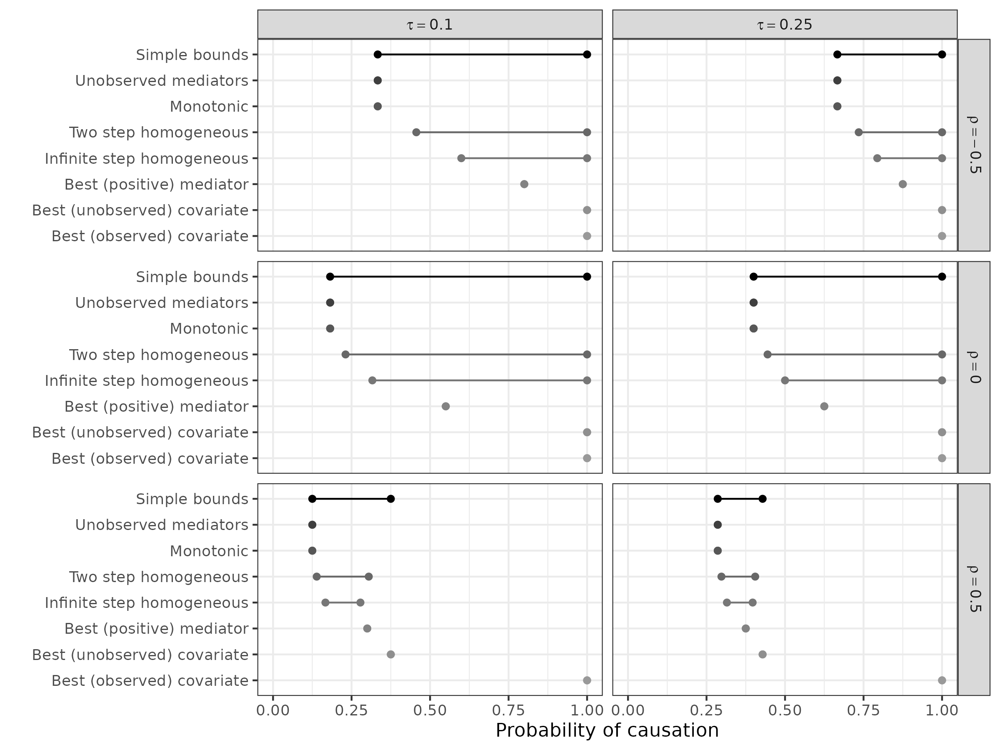
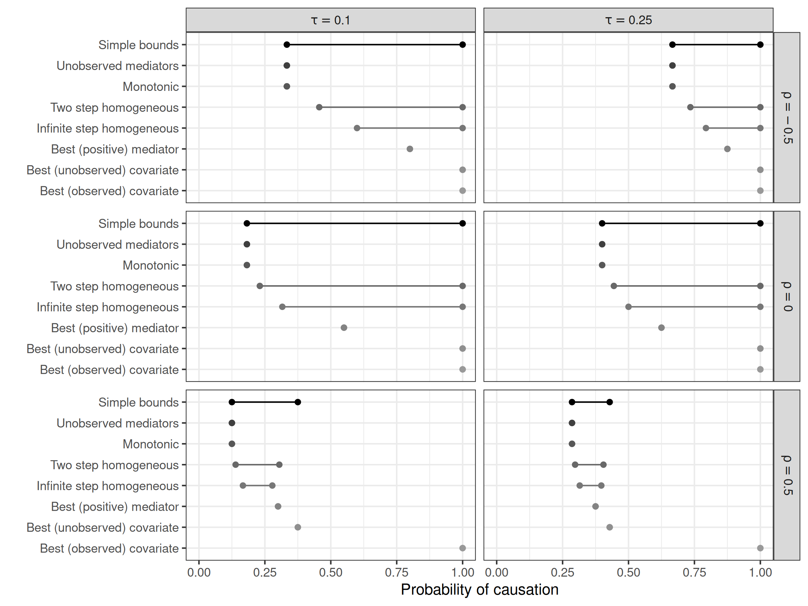

# Replication Examples Using Code

``` r
library(replicateEverything)
```

### System Architecture

This is the system architecture on which this package is built. There is
a registry that host all the repositories for past studies. Then, the
`replicateEverything` package interact with the repositories and then
works the magic.

## Run single replication

``` r
run_replication(
  "10.1177/00491241211036161",
  "fig_1"
)
```

    ## [1] "fig_1"

    ## Using repository: replicate-anything/registry

    ## Replication type: figure

    ## Ignoring unknown labels:
    ## • shape : "ρ"



## Replicate an entire paper

``` r
replicate_paper("10.1177/00491241211036161")
```

    ## Replicating: Bounding Causes of Effects With Mediators

    ## 

    ## Running: fig_1

    ## Ignoring unknown labels:
    ## • shape : "ρ"


