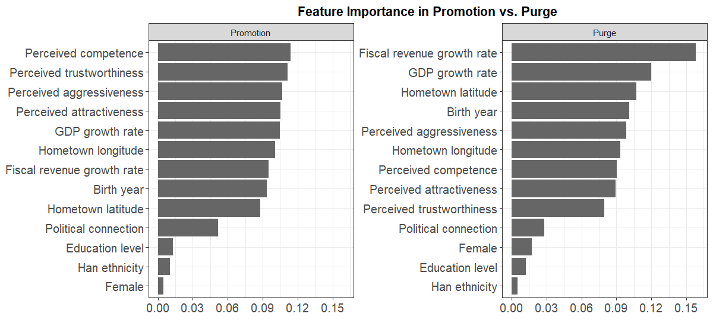

# Why replicateEverything?

**replicateEverything** is a prototype system to:

- structure replication code as a connected pipeline
- fetch and run that code from a DOI (or registry handle)
- check that it still works — one study, or a whole journal at once
- link base replications to downstream re-analyses without copying files

You can use it from `R` or your
[browser](https://shiny2.wzb.eu/ipi/replicate/).

TL;DR — just do this

``` r

# Figure 4 from Jiang and Yang (2026)
replicateEverything::run_replication(
  doi = "10.1017/s0003055426101749",
  what = "fig_4"
)
```



## Why bother?

Computational replication has never been easier. But it is still a bit
of a jungle. Archives are *ad hoc* in structure, paths shift,
dependencies drift, and every new reader has to re-wrangle the
collection of files they download from dataverse or osf. Plus there are
no guarantees: Nobody runs a standing check that the archive still runs
today.

`replicateEverything` contributes by proposing a format that makes code
quickly accessible and runnable.

Are we fighting the last battle? You might wonder (we certainly wonder):
if an AI can rewrite the analysis from a paper on the fly, why keep an
authoritative codebase? Our answer: Because the code is a *record* of
analytic choices. When results disagree, you need a shared object to
inspect, not a fresh vibe-coded reimplementation. That case gets
stronger, we think, as models get better at improvising.

So this is an attempt to keep humans in the loop.

Here’s a walk through of the main elements plus the bells and whistles.

## The registry (what is in there so far)

The [registry](https://github.com/replicate-anything/registry) indexes
studies with lightweight stubs; code and data live in linked study
repos. The index is still small — but you can browse what is there:

``` r

library(replicateEverything)
head(load_index()[, c("doi", "title", "year")])
```

Example output:

    #>  doi                         title                                   year
    #>  10.1177/00491241211036161   Bounding Causes of Effects ...          2022
    #>  10.1017/S0003055403000534   Ethnicity, Insurgency, and Civil War    2003 
    #>  10.1017/s0003055426101749   ...                                     2026 

Each study in the registry has a designated maintainer; right now that
is us, but we hope that others will start adding and commit to
maintaining.

## Run one result, from the top or from the middle

Pass a DOI and a step id (`fig_1`, `tab_1`, …):

``` r

library(replicateEverything)

# Replicate table 1 assuming any parent steps have already been run
run_replication(
  doi = "10.1017/S0003055403000534",
  what = "tab_1"
)

# Replicate table 1 assuming no parent steps have been run 
run_replication(
  doi = "10.1017/S0003055403000534",
  what = "tab_1", 
  given = "nothing"
 )

# Running step: analysis_data
# Running step: tab_1
```

[`list_replications()`](https://replicate-anything.github.io/replicateEverything/reference/list_replications.md)
shows what you can run from a given study:

``` r

list_replications("10.1017/S0003055403000534")
# Replications: Ethnicity, Insurgency, and Civil War [10.1017/s0003055403000534]
#        id   type engine                      label
#     tab_1  table      r                     Table 1
# tab_1_stata table  stata                     Table 1
```

Run from top to bottom to get a list of all objects created including
all intermediate datasets.

``` r

run_replication("10.1017/S0003055403000534", what = "everything")
```

For `what = "everything"`, upstream prep runs automatically (`given`
defaults to `"nothing"`). For a single table or figure, the default is
`"parents"` — use existing intermediate outputs when they are already on
disk.

Pass `format = TRUE` for display-ready HTML or formatted plots; the
default returns raw analysis objects (models, `ggplot`s, and so on).

## Inspect code

You can pull the script any time:

``` r

get_code("10.1017/S0003055403000534", "tab_1")
```

## Repo structures

### The `yaml` is our big ask

The main ask of repo contributors is that you provide a `yaml` file to
accompany your repo.

The `yaml` file is a simple text file that provides a map to making
sense of your archive. Once `replicateEverything` has access to this
file it knows what objects are produced, where the code is that makes
them, where they fit in relation to each other, what their dependencies
are, what languages they use, where their outputs get saved. From there
it can put everything together, produce lovely output and expose code on
demand. A basic `yaml` is easy to write and in the template rep we give
a simple example in our
[template](https://github.com/replicate-anything/rep-template/blob/main/replication.yml).

### Replication archives are DAGs

A minimally complex replication archive specifes a set of steps to get
from raw data to publication ready outputs. It has an implied directed
acyclical graphical (DAG) structure. `replicateEverything` reads that
graph from `replication.yml` so you can start from prepared data or from
scratch.

``` r

describe_study_dag("10.1017/S0003055403000534")
```

See *Reanalysis and extension studies* for downstream repos that inherit
upstream steps without duplicating code.

## Wrinkles and features

### Reanalysis without redundancy

You want to re-analyze a study with minimal alterations? Extension
studies set `paper.extends` and `inherit:` steps. Inherited prep runs in
the base repo; new analysis reads base `outputs/`. Details:
[`vignette("reanalysis-studies")`](https://replicate-anything.github.io/replicateEverything/articles/reanalysis-studies.md).

### Many languages, one entry point

Folder-backed studies may mix R, Stata, and Python. Pick the engine with
`language =` when both exist. See
[`vignette("stata-replications")`](https://replicate-anything.github.io/replicateEverything/articles/stata-replications.md).

``` r

# Stata when both engines exist:
run_replication(
  doi = "10.1257/aer.91.5.1369",
  what = "tab_2",
  language = "stata"
)
```

### Code exposure

When you prepare a replication repository you have some discretion in
how much code you expose and how much you tuck away out of view. Tucking
things away can make code easier to read but also risks reducing
transparency. `replicateEverything` uses two approaches to manage the
trade off. First you can use the DAG structure to package separately
discrete steps (like data preparation) that do not need to be rerun
often but that users nevertheless might want to inspect and other steps
where the most important action happens (analysis steps, perhaps).
Second, when the `replicateEverything` shiny displays code that itself
sources from other code files (`source(...)`) you can click on these
sourcing lines to take you to nested code files.

### Collections

The registry rows carry `collections` tags (`APSR`, `PED`, `IPI`,
`World Bank`, …) for filtering in the Shiny bibliography. To audit every
study in a collection:

``` r

audit_everything(patience = 20, collections = "APSR")
```

As a researcher you could have a collection of all your own studies. As
a journal you could have a collection of yours only. You can run an
instance of the shiny app restricted to studies in your collection only.

## Using AI to prep your archive

The fastest path from a messy delivery to a registry-ready study is
often an agent with the package **skills** — markdown playbooks shipped
in `inst/ai/skills/`:

``` r

ai_skills()
# folder-replication       — generic folder-backed study repo
# dataverse-to-replicate-everything — Harvard Dataverse replication deposits
```

Point Cursor (or another agent) at the skill, give it your replication
folder, and ask it to produce `replication.yml` with a `steps:` DAG,
`outputs/` paths, tests, and a registry stub. The skills spell out
layout, dependency probing, substantive tests, and
[`check_replication()`](https://replicate-anything.github.io/replicateEverything/reference/check_replication.md).

Practical tips without an agent:

1.  **Start from the published code**, not a rewrite — discover the true
    pipeline (what reads what) before you yaml it.
2.  **One script per step**; declare inputs, outputs, and parents in
    `steps:`.
3.  **Run**
    [`check_and_bake_study()`](https://replicate-anything.github.io/replicateEverything/reference/check_and_bake_study.md)
    (which calls
    [`check_replication()`](https://replicate-anything.github.io/replicateEverything/reference/check_replication.md))
    before opening a registry PR.
4.  **Add substantive tests** under `tests/substantive/` when you have
    published benchmarks (see Fearon & Laitin `tab_1`).

Skill files live at
`system.file("ai/skills", package = "replicateEverything")` after
install.

## Where to go next

| If you want to… | Read |
|----|----|
| Tour every main function | [`vignette("meet-the-functions")`](https://replicate-anything.github.io/replicateEverything/articles/meet-the-functions.md) |
| Run examples from code | [`vignette("replication-example")`](https://replicate-anything.github.io/replicateEverything/articles/replication-example.md) |
| Build or migrate a folder-backed study | [`vignette("folder-replication-checklist")`](https://replicate-anything.github.io/replicateEverything/articles/folder-replication-checklist.md) |
| Onboard a Harvard Dataverse deposit | skill `dataverse-to-replicate-everything` |
| Add a reanalysis repo | [`vignette("reanalysis-studies")`](https://replicate-anything.github.io/replicateEverything/articles/reanalysis-studies.md) |
| Use Stata (or bilingual R/Stata) | [`vignette("stata-replications")`](https://replicate-anything.github.io/replicateEverything/articles/stata-replications.md) |
| Browse and run in the browser | [`vignette("shiny-app")`](https://replicate-anything.github.io/replicateEverything/articles/shiny-app.md) |
| Audit the whole registry | [`vignette("audit")`](https://replicate-anything.github.io/replicateEverything/articles/audit.md) |
| Install dependencies on a server | [`vignette("maintainer-setup")`](https://replicate-anything.github.io/replicateEverything/articles/maintainer-setup.md) |
| Package-backed studies | [`vignette("package-replication-checklist")`](https://replicate-anything.github.io/replicateEverything/articles/package-replication-checklist.md) |

Live app:
[shiny2.wzb.eu/ipi/replicate/](https://shiny2.wzb.eu/ipi/replicate/).
Registry:
[github.com/replicate-anything/registry](https://github.com/replicate-anything/registry).
