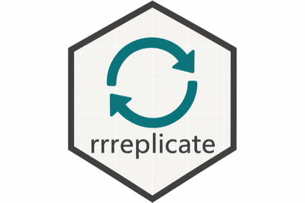

# replicateEverything



**Tools to discover, run, and contribute computational replications of
empirical research papers.**

`replicateEverything` connects to a public [replication
registry](https://github.com/replicate-anything/registry), retrieves
replication materials (metadata, processed data, and analysis code), and
reproduces figures and tables from published studies in a standardized
workflow. The package also bundles a **Shiny demo app** for browsing
studies and running replications interactively — try the [live
demo](https://shiny2.wzb.eu/ipi/replicate/).

**Start here:** [Why
replicateEverything?](https://replicate-anything.github.io/replicateEverything/articles/why-replicateEverything.html)
— the best high-level overview of motivation, the registry, and how to
run replications.

## Key features

- **Discovery** — search the registry, look up papers by DOI, and
  inspect available replications
- **One-line replication** — run a single figure or table, or reproduce
  an entire paper with `run_replication(doi, "everything")`
- **Registry-backed materials** — fetch data and code from GitHub
  without manual downloads
- **Folder-backed studies** — dedicated study repositories with `code/`,
  `data/`, and `outputs/`
- **Package-backed studies** — standalone R packages linked from
  lightweight registry stubs
- **Artifacts** — load, validate, and save precomputed outputs (PNG,
  HTML, RDS) for fast display
- **Display pipeline** — optional `format_*` steps turn analysis objects
  into HTML tables and ggplot figures
- **Shiny demo** — [live app](https://shiny2.wzb.eu/ipi/replicate/);
  [`run_shiny_app()`](https://replicate-anything.github.io/replicateEverything/reference/run_shiny_app.md)
  locally;
  [`save_local_shiny()`](https://replicate-anything.github.io/replicateEverything/reference/save_local_shiny.md)
  to deploy on Shiny Server
- **Contributor tooling** — validate and register folder- or
  package-backed studies
  ([`prepare_study_for_registry()`](https://replicate-anything.github.io/replicateEverything/reference/prepare_study_for_registry.md),
  [`check_replication()`](https://replicate-anything.github.io/replicateEverything/reference/check_replication.md),
  [`validate_outputs()`](https://replicate-anything.github.io/replicateEverything/reference/validate_outputs.md))
- **Bundled AI skills** — markdown workflow guides for assistants
  ([`ai_skills()`](https://replicate-anything.github.io/replicateEverything/reference/ai_skills.md),
  [`ai_skill()`](https://replicate-anything.github.io/replicateEverything/reference/ai_skill.md))

## Project status

The project is under active development. Feedback is welcome — contact
[Vermon Washington](mailto:vermon.washington@wzb.eu) or [Macartan
Humphreys](mailto:macartan.humphreys@wzb.eu).

## Installation

Install from GitHub with `remotes` or `devtools`:

``` r

remotes::install_github("replicate-anything/replicateEverything")
# or
devtools::install_github("replicate-anything/replicateEverything")
```

Requires R (\>= 4.1.0).

## Quick start

``` r

library(replicateEverything)

# Browse the registry index
head(load_index()[, c("doi", "title", "year")])

# Search the registry by title keyword
search_papers("causes")

# See what can be replicated for a paper
list_replications("10.1177/00491241211036161")

# Run one figure or table
run_replication("10.1177/00491241211036161", "fig_1")

# Reproduce every registered result
run_replication("10.1177/00491241211036161", "everything")
```

For a tour of every main function, see [Meet the
functions](https://replicate-anything.github.io/replicateEverything/articles/meet-the-functions.html).
For a worked example with output, see the [replication
vignette](https://replicate-anything.github.io/replicateEverything/articles/replication-example.html).

## How it works

The [registry](https://github.com/replicate-anything/registry) indexes
studies via lightweight stub files in `studies/<folder>.yml`.
**Folder-backed** studies keep code, data, and display outputs in a
dedicated study repository; **package-backed** studies keep them in an R
package. `replicateEverything` reads the stub, loads the full
`replication.yml` from the study repo or package, and runs the
registered scripts.

    Registry                         Study repo or package
      studies/<folder>.yml  ───────►  replication.yml
      index.csv                      data/  code/  outputs/
                  ↓
          replicateEverything
                  ↓
          figures & tables in your R session

### Registry layout

Each indexed paper has one stub file:

    studies/
      10.1177_00491241211036161.yml
      10.1371_journal.pone.0278337.yml

Folder-backed study repositories follow:

    replication.yml
    data/
    code/
    outputs/
    tests/testthat/

Package-backed study packages follow the layout in [Package-backed
replications](#package-backed-replications) below.

The `<folder>` name comes from the registry `index.csv` (for example
`10.1177_00491241211036161` or `10.1017S0003055403000534`).

### Example `replication.yml`

``` yaml
paper:
  title: My wonderful paper
  authors:
    - replicateEverything, Team
  year: 2024
  doi: 1.2.3.4
  journal: Sample journal

replications:
  - id: fig_1
    type: figure
    label: Figure 1
    description: Example figure
    data: data/fig_1.csv
    code: code/fig_1.R
    outputs:
      - outputs/fig_1.png
    dependencies:
      - ggplot2

  - id: tab_1
    type: table
    label: Table 1
    description: Example table
    data: data/tab_1.csv
    code: code/tab_1.R
    format: format_tab_1
    outputs:
      - outputs/tab_1.html
    dependencies:
      - dplyr
      - gt
```

## Writing replication scripts

Replication scripts define an analysis function named `make_<id>()` (for
example `make_fig_1()`). The legacy names `generate_figure()` and
`generate_table()` are still supported.

### Figures

``` r

make_fig_1 <- function(data) {
  ggplot2::ggplot(data, ggplot2::aes(group, value)) +
    ggplot2::geom_col()
}
```

### Tables

``` r

make_tab_1 <- function(data) {
  dplyr::summarise(data, mean_value = mean(value))
}

format_tab_1 <- function(object) {
  # optional: convert the analysis object to HTML for display
  as.character(object)
}
```

When `replication.yml` lists a `format` field, the package passes the
analysis output through the corresponding `format_*` function before
display or artifact export.

### Pure definitions; yaml executes

Authors write `make_*` / `format_*` only. \[run_replication()\] loads
data from yaml `data:` / `inputs:`, calls `make_*`, and applies
`format_*` when requested. No interactive footer is required. For a
copy-pasteable recipe, use `get_code(doi, what, mode = "run")` (appends
the yaml-implied call) or prefer `run_replication(doi, what)` directly.

## Folder-backed replications

Studies maintained as a **simple Git repository** (`code/`, `data/`,
`outputs/`) can be linked from the registry. Keep a stub in
`studies/<folder>.yml` only:

``` yaml
paper:
  doi: https://doi.org/10.1177/00491241211036161
  title: Bounding Causes of Effects With Mediators
  materials: folder
  study_repo: replicate-anything/rep-10.1177-00491241211036161
  study_folder: rep-10.1177-00491241211036161
  study_ref: main
repo: replicate-anything/rep-10.1177-00491241211036161
```

The full `steps:` pipeline lives in the study repo’s `replication.yml`.
Display outputs live in `outputs/` (from
[`build_study_outputs()`](https://replicate-anything.github.io/replicateEverything/reference/build_study_outputs.md)).

**From the study repository root:**

``` r

library(replicateEverything)

options(
  replicateEverything.registry_root = "../registry",
  replicateEverything.use_sibling_packages = TRUE
)

# 1. Build outputs/manifest.json
build_study_outputs(location = ".", install_deps = TRUE)

# 2. Run tests
testthat::test_dir("tests/testthat")

# 3. Check + write registry/replication.yml and registry/index.csv
prepare_study_for_registry(".", build_artifacts = FALSE, registry_root = "../registry")

# 4. Sync stub into registry checkout
sync_study_to_registry(".", registry_root = "../registry")

# One-step alternative when registry is local:
# add_folder_paper(".", registry_root = "../registry")
```

See
[`vignette("folder-replication-checklist", package = "replicateEverything")`](https://replicate-anything.github.io/replicateEverything/articles/folder-replication-checklist.md)
for the full workflow.

## Package-backed replications

Studies maintained as standalone R packages can be linked from the
registry. Keep a stub file `studies/<folder>.yml` that points to the
package (no materials in the registry):

``` yaml
paper:
  doi: https://doi.org/10.1371/journal.pone.0278337
  title: "Public support for global vaccine sharing in the COVID-19 pandemic"
  package: rep1371journalpone0278337
  package_folder: rep-10.1371-journal.pone.0278337
  package_repo: replicate-anything/rep-10.1371-journal.pone.0278337
  package_ref: main
repo: replicate-anything/rep-10.1371-journal.pone.0278337
```

`replicateEverything` merges the full `replications:` list from the
study package `replication.yml` when the registry stub omits it. Display
artifacts live in the study package at `inst/report/artifacts/` (from
`build_report()`).

Validate and register a package-backed study:

``` r

options(replicateEverything.registry_root = "/path/to/registry")

check_replication("/path/to/rep_package")
add_paper("/path/to/rep_package", full_replication = FALSE)
```

See
[`vignette("package-replication-checklist", package = "replicateEverything")`](https://replicate-anything.github.io/replicateEverything/articles/package-replication-checklist.md)
for requirements.

**Local development (monorepo):** place the study package as a sibling
folder next to `registry/`. Enable sibling resolution with:

``` r

options(replicateEverything.use_sibling_packages = TRUE)
options(replicateEverything.replication_packages_root = "/path/to/monorepo")
```

**Published packages:** set `package_repo` (and top-level `repo`) to the
GitHub slug. The package installs via
[`remotes::install_github()`](https://remotes.r-lib.org/reference/install_github.html)
when no local sibling is found.

Optional overrides:

- `paper.package_path` — absolute or relative path to the package root
- `options(replicateEverything.replication_packages = list(pkgname = "/path"))`

Linked study packages should export:
[`list_replications()`](https://replicate-anything.github.io/replicateEverything/reference/list_replications.md),
`replication_meta()`, `run_replication(id)`, `load_artifact(id)`,
`artifact_file(id)`, `get_code(id)`, and `build_report()`.

## API overview

| Task | Function |
|----|----|
| Browse registry | [`load_index()`](https://replicate-anything.github.io/replicateEverything/reference/load_index.md), [`search_papers()`](https://replicate-anything.github.io/replicateEverything/reference/search_papers.md) |
| List replications | [`list_replications()`](https://replicate-anything.github.io/replicateEverything/reference/list_replications.md), `list_replications(..., grouped = TRUE)` |
| View source code | [`get_code()`](https://replicate-anything.github.io/replicateEverything/reference/get_code.md) |
| Run one replication | [`run_replication()`](https://replicate-anything.github.io/replicateEverything/reference/run_replication.md) |
| Replicate full paper | `run_replication(doi, "everything")` |
| Build folder study outputs | [`build_study_outputs()`](https://replicate-anything.github.io/replicateEverything/reference/build_study_outputs.md) |
| Prepare folder study | [`prepare_study_for_registry()`](https://replicate-anything.github.io/replicateEverything/reference/prepare_study_for_registry.md) |
| Sync folder study to registry | [`sync_study_to_registry()`](https://replicate-anything.github.io/replicateEverything/reference/sync_study_to_registry.md) |
| Validate study layout + tests | [`check_replication()`](https://replicate-anything.github.io/replicateEverything/reference/check_replication.md) |
| Check precomputed outputs exist | [`validate_outputs()`](https://replicate-anything.github.io/replicateEverything/reference/validate_outputs.md) |
| Registry-wide output check | `validate_outputs(doi = "everywhere", what = "everything")` |
| List bundled AI skills | [`ai_skills()`](https://replicate-anything.github.io/replicateEverything/reference/ai_skills.md), [`ai_skill()`](https://replicate-anything.github.io/replicateEverything/reference/ai_skill.md) |
| Registry health check | [`audit_everything()`](https://replicate-anything.github.io/replicateEverything/reference/audit_everything.md) |
| Shiny demo | [`run_shiny_app()`](https://replicate-anything.github.io/replicateEverything/reference/run_shiny_app.md), [`save_local_shiny()`](https://replicate-anything.github.io/replicateEverything/reference/save_local_shiny.md) |

Set `install_deps = TRUE` on run functions to install missing CRAN
dependencies automatically.

### AI skills

This package ships AI-readable workflow guides under `inst/ai/skills/`.
Use them with ChatGPT, Claude, Cursor, Copilot, or other assistants.

``` r

ai_skills()
# [1] "dataverse_to_replicateEverything"

cat(ai_skill("dataverse_to_replicateEverything"))
```

Installed path:

``` r

system.file("ai", "skills", "dataverse_to_replicateEverything.md", package = "replicateEverything")
```

### Local registry development

Point the package at a local clone of the registry:

``` r

options(replicateEverything.registry_root = "/path/to/registry")
options(replicateEverything.index = read.csv("/path/to/registry/index.csv"))
```

## Contributor workflow

1.  **Browse the registry** —
    [`load_index()`](https://replicate-anything.github.io/replicateEverything/reference/load_index.md)
    or `search_papers("keyword")`
2.  **Set up a study repo** — follow
    [`vignette("folder-replication-checklist")`](https://replicate-anything.github.io/replicateEverything/articles/folder-replication-checklist.md)
    or
    [`vignette("package-replication-checklist")`](https://replicate-anything.github.io/replicateEverything/articles/package-replication-checklist.md)
3.  **Add your data and code** — place processed data in `data/` and
    scripts in `code/`
4.  **Test locally** — run scripts in the R console or with
    [`run_replication()`](https://replicate-anything.github.io/replicateEverything/reference/run_replication.md)
5.  **Submit to the registry** — clone
    [replicate-anything/registry](https://github.com/replicate-anything/registry),
    move your paper folder into `studies/`, and open a pull request

For **folder-backed** studies, run
[`prepare_study_for_registry()`](https://replicate-anything.github.io/replicateEverything/reference/prepare_study_for_registry.md)
to build outputs, validate, and write `registry/replication.yml` +
`registry/index.csv` in the study repo; then
[`sync_study_to_registry()`](https://replicate-anything.github.io/replicateEverything/reference/sync_study_to_registry.md)
(or
[`refresh_registry()`](https://replicate-anything.github.io/replicateEverything/reference/refresh_registry.md)
on the registry checkout).

For **package-backed** studies, use
[`add_paper()`](https://replicate-anything.github.io/replicateEverything/reference/add_paper.md)
after
[`check_replication()`](https://replicate-anything.github.io/replicateEverything/reference/check_replication.md)
passes instead of copying code and data into the registry.

``` bash
git clone https://github.com/replicate-anything/registry
mv 10.1177_00491241211036161 registry/studies/
cd registry
git add .
git commit -m "Add replication for 10.1177/00491241211036161"
git push
```

## Developer workflow

``` bash
git clone https://github.com/replicate-anything/replicateEverything
cd replicateEverything
```

``` r

devtools::install()
devtools::test()
devtools::check()
```

Documentation site:
[replicate-anything.github.io/replicateEverything](https://replicate-anything.github.io/replicateEverything/)

## Shiny demo app

Try the [live demo](https://shiny2.wzb.eu/ipi/replicate/) at WZB, or run
the bundled app from an installed package:

``` r

library(replicateEverything)
run_shiny_app()                              # run from installed package
save_local_shiny("/path/to/shiny/replicate") # materialize app.R + www/ for serving
```

See
[`vignette("shiny-app", package = "replicateEverything")`](https://replicate-anything.github.io/replicateEverything/articles/shiny-app.md)
for server update workflows and `local.R` configuration.

## Links

- **Package:**
  [github.com/replicate-anything/replicateEverything](https://github.com/replicate-anything/replicateEverything)
- **Registry:**
  [github.com/replicate-anything/registry](https://github.com/replicate-anything/registry)
- **Documentation:**
  [replicate-anything.github.io/replicateEverything](https://replicate-anything.github.io/replicateEverything/)

## Report bugs

Open an issue at
[github.com/replicate-anything/replicateEverything/issues](https://github.com/replicate-anything/replicateEverything/issues).

## License

MIT
